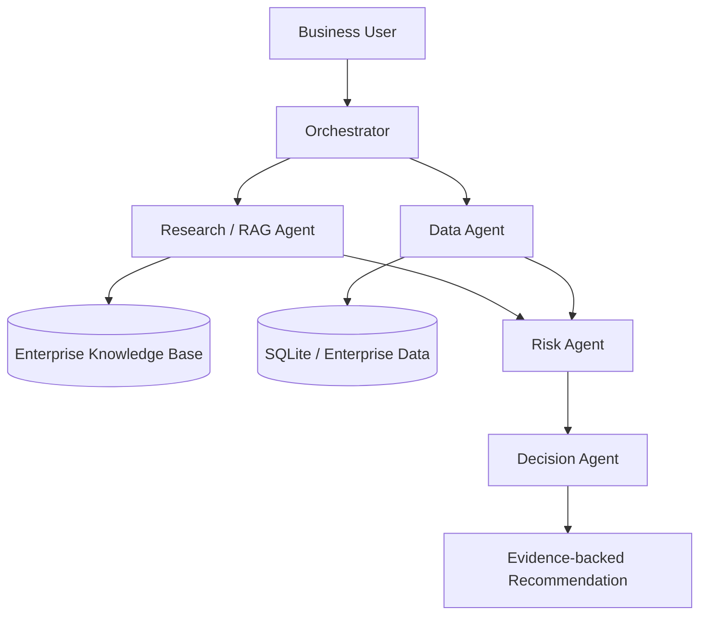

# Architecture

## Agent responsibilities

| Agent | Responsibility |
|---|---|
| Orchestrator | Understand request and coordinate workflow |
| Research/RAG | Retrieve policy and governance evidence |
| Data Agent | Query structured vendor/business data |
| Risk Agent | Calculate risk using business signals |
| Decision Agent | Rank options and produce recommendation |
| Response | Present recommendation, rationale and evidence |

## Azure production mapping

- Azure AI Foundry / Azure OpenAI → agent and LLM runtime
- Azure AI Search → enterprise RAG index
- Azure SQL / Microsoft Fabric → structured business data
- Azure Blob Storage / ADLS Gen2 → source documents
- Azure Key Vault → secrets
- Microsoft Purview → governance and lineage
- Application Insights → observability
